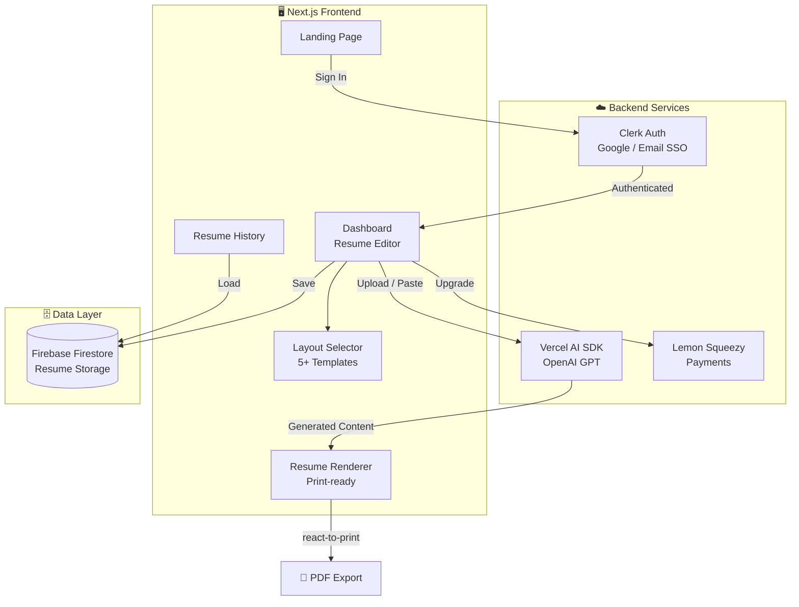
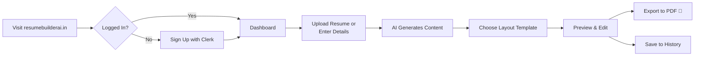

<p align="center">
  <h1 align="center">📄 ResumeBuilder.ai</h1>
  <p align="center"><strong>AI-Powered Resume Builder with Multiple Professional Layouts</strong></p>
  <p align="center">
    Upload your existing resume or paste your details — AI generates a polished, ATS-optimized resume in seconds. Choose from 5+ professional layouts, export to PDF, and manage your resume history.
  </p>
</p>

<p align="center">
  <a href="https://resumebuilderai.in"></a>
</p>

<p align="center">
  
  
  
  
  
  
</p>

---

## ✨ Features

- 🤖 **AI-Powered Generation** — Paste your details or upload an existing resume; AI restructures and optimizes content
- 📐 **5+ Professional Layouts** — Professional, Modern, Minimal, Creative, and IIT Kanpur format
- 📤 **File Upload** — Import existing resumes (PDF/DOCX) as a starting point for AI enhancement
- 🖨️ **PDF Export** — Print-ready output via `react-to-print`
- 🔐 **Authentication** — Clerk-powered sign-in with Google/Email
- 📜 **Resume History** — Save, revisit, and iterate on past versions
- 💳 **Premium Plans** — Lemon Squeezy integration for monetization
- 🌐 **Multilingual Support** — Language context with translations
- 🎨 **Dark Theme** — Sleek dark UI with orange accent colors
- ♿ **Accessible** — Built on Radix UI primitives for full accessibility

---

## 🛠️ Tech Stack

| Layer | Technology |
|-------|-----------|
| **Framework** | Next.js 16 (App Router) |
| **Styling** | Tailwind CSS + Radix UI + shadcn/ui |
| **Auth** | Clerk (@clerk/nextjs) |
| **AI** | Vercel AI SDK + OpenAI |
| **Payments** | Lemon Squeezy |
| **Database** | Firebase Firestore |
| **Hosting** | Firebase App Hosting |
| **PDF Export** | react-to-print |

---

## 🏗️ Architecture



---

## 🔄 User Flow



---

## 📁 Project Structure

```
RESUMEBUILDER.ai/
├── app/
│   ├── page.tsx                    # Landing page
│   ├── layout.tsx                  # Root layout (Clerk + theme)
│   ├── dashboard/                  # Main editor
│   │   ├── page.tsx                # Resume builder UI
│   │   └── layout.tsx
│   ├── history/                    # Saved resumes
│   │   └── page.tsx
│   ├── login/                      # Auth page
│   ├── actions/
│   │   └── generate-content.ts     # AI generation server action
│   ├── components/
│   │   ├── resume-renderer.tsx     # Core resume display
│   │   ├── layout-selector.tsx     # Template picker
│   │   ├── file-upload.tsx         # Resume import
│   │   ├── generation-progress.tsx # AI progress UI
│   │   ├── pricing-modal.tsx       # Subscription plans
│   │   └── atelier-sidebar.tsx     # Editor sidebar
│   ├── lib/
│   │   ├── layouts.ts              # Layout registry
│   │   ├── resume.ts               # Resume data model
│   │   ├── auth-context.tsx        # Auth state
│   │   ├── lemonsqueezy.ts         # Payment integration
│   │   └── storage.ts              # Firestore operations
│   └── api/                        # API routes
├── components/                     # Shared shadcn/ui components
├── firebase.json                   # Firebase config
├── apphosting.yaml                 # Firebase App Hosting
├── dataconnect/                    # Firebase Data Connect
└── package.json
```

---

## 🚀 Quick Start

### Prerequisites

- Node.js 18+
- Clerk account (for auth)
- OpenAI API key
- Firebase project

### 1. Clone & Install

```bash
git clone https://github.com/deevashb24/RESUMEBUILDER.ai.git
cd RESUMEBUILDER.ai
npm install
```

### 2. Configure Environment

Create a `.env.local` file:

```env
NEXT_PUBLIC_CLERK_PUBLISHABLE_KEY=pk_...
CLERK_SECRET_KEY=sk_...
OPENAI_API_KEY=sk-...
NEXT_PUBLIC_FIREBASE_API_KEY=...
NEXT_PUBLIC_FIREBASE_PROJECT_ID=...
LEMONSQUEEZY_API_KEY=...
```

### 3. Start Development Server

```bash
npm run dev
```

Open [http://localhost:3000](http://localhost:3000) to see the app.

---

## 🌐 Deployment

The app is live at **[resumebuilderai.in](https://resumebuilderai.in)**, deployed via Firebase App Hosting.

```bash
# Deploy to Firebase
npx firebase-tools deploy
```

---

## 📸 Screenshots

> _Visit [resumebuilderai.in](https://resumebuilderai.in) to see the live product._

---

## 🤝 Contributing

1. Fork the repo
2. Create your feature branch (`git checkout -b feature/new-layout`)
3. Commit your changes (`git commit -m 'Add new resume layout'`)
4. Push to the branch (`git push origin feature/new-layout`)
5. Open a Pull Request

---

## 📄 License

This project is open source and available under the [MIT License](LICENSE).

---

<p align="center">
  <strong>Build your perfect resume — powered by AI ✨</strong>
</p>
